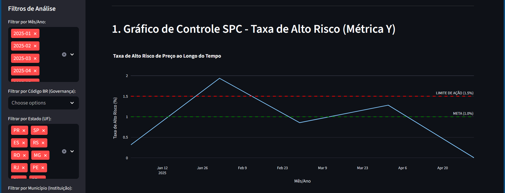
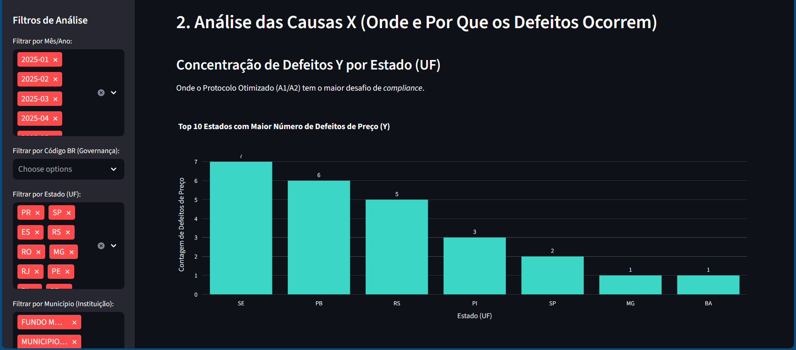
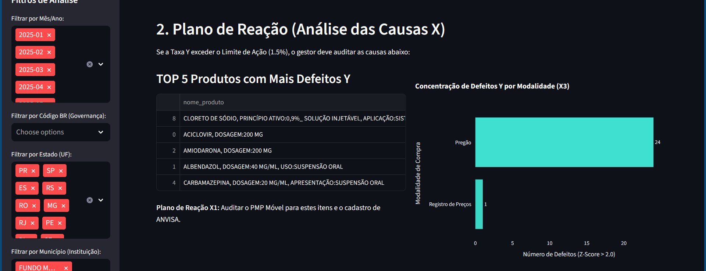
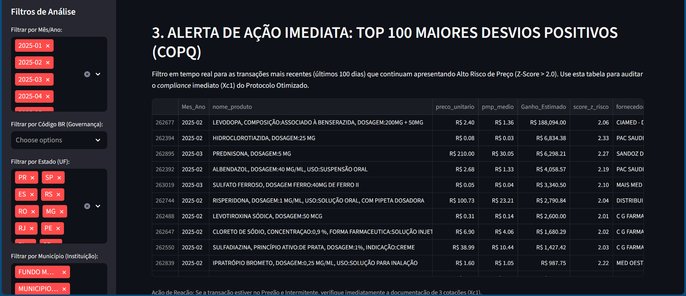

# PROJETO GREEN BELT: MITIGAÇÃO DO ALTO RISCO DE PREÇO EM COMPRAS PÚBLICAS

Este repositório documenta a aplicação da metodologia Lean Six Sigma (Green Belt) para resolver um problema estratégico no processo de aquisição de medicamentos: a **instabilidade e o gasto excessivo** resultantes de transações com Alto Risco de Preço, concentradas em itens intermitentes e na modalidade Pregão.

**Treinamento:** Murilo Fonseca - Instrutor Master Black Belt

---

## Detalhamento Técnico (Metodologia DMAIC)


### FASE DEFINE (O Escopo Estratégico)

O problema foi formalmente redefinido com base no valor financeiro e na variabilidade do processo (Defeito Y).

| Métrica Chave | Definição | Baseline Comprovado | Meta SMART |
| :--- | :--- | :--- | :--- |
| **Métrica Y** (Defeito) | Taxa de Transações com Alto Risco de Preço (Z-Score $|>2.0|$). | **2.50%** | Redução para **1.0%**. |
| **Dano (COPQ)** | Risco de Gasto Excessivo. | Casos críticos com Z-Score de até $\mathbf{17.34}$. | Mitigação de $\mathbf{60\%}$ do risco. |


### FASE MEASURE & ANALYZE (O Diagnóstico da Causa Raiz)

A análise estatística comprovou que o problema é sistêmico, concentrando-se na interseção de duas causas raízes:

| Causa Raiz (X) | Impacto Comprovado | Ação de Melhoria (IMPROVE) |
| :--- | :--- | :--- |
| **X1: Risco de Intermitência** | $\mathbf{100\%}$ dos Defeitos (Y) | Implementar o uso de **PMP Móvel (6 meses)**. |
| **X3: Modalidade Pregão** | $\mathbf{83.18\%}$ dos Defeitos (Y) | Implementar o **Protocolo de Sourcing Otimizado (3 Cotações)**. |


### Amostra dos Outliers Positivos (Evidência do Dano)

A tabela a seguir apresenta os maiores desvios de preço, comprovando o Gasto Excessivo em itens intermitentes, principalmente no Pregão:

| ID Produto | Modalidade | Intermitência (X1) | Preço Pago (Y) | PMP Médio Ref. | Z-Score Risco |
|:---|:---|:---|:---|:---|---:|
| Pro00485 | Dispensa de Licitação | 46.2% | R$ 195.43 | R$ 3.50 | 17.34 |
| Pro00175 | Pregão | 47.7% | R$ 302.50 | R$ 5.73 | 16.37 |
| Pro07282 | Pregão | 81.5% | R$ 3,072.00 | R$ 39.52 | 16.07 |
| Pro00097 | Pregão | 44.6% | R$ 73.86 | R$ 0.49 | 15.17 |
| Pro07441 | Pregão | 70.8% | R$ 6,000.00 | R$ 29.69 | 14.46 |


### FASE IMPROVE: Protocolo de Sourcing Otimizado

A solução é a implementação de um **Protocolo Otimizado (Ações A1/A2)**, ativado por um **Gatilho de Risco** que mira apenas nas transações mais críticas.

| Ação de Melhoria | Alvo (Causa X) | Entregável de Processo |
| :--- | :--- | :--- |
| **A1. 3 Cotações Obrigatórias** | X3 (Pregão) | Exigir validação externa de preço para o Alto Risco. |
| **A2. PMP Móvel (6 Meses)** | X1 (Intermitência) | Substituir o *benchmark* volátil por um PMP mais recente e estável. |
| **A4. Poka-Yoke de Governança** | X2 (Dados) | Bloquear a aprovação de itens de Alto Risco sem o Código ANVISA. |

> **Foco Estratégico (Lean):** O novo protocolo será aplicado APENAS nas **5.894 transações** que cumprem o critério de Alto Risco de Aquisição, maximizando o impacto com esforço mínimo ($\mathbf{2.24\%}$ do universo total).

---

### FASE CONTROL: Monitoramento Estatístico (SPC)

O sucesso e a sustentabilidade das ações são garantidos pelo monitoramento contínuo das métricas de processo e de resultado em um Dashboard de Controle.

| Métrica Monitorada | Tipo de Métrica | Limite de Controle (UCL) |
| :--- | :--- | :--- |
| **Taxa de Alto Risco (Y)** | Resultado | $\mathbf{1.5\%}$ (Dispara Auditoria e Ação de Reação). |
| **Compliance 3 Cotações (Xc1)** | Processo | $\mathbf{90\%}$ (Abaixo disso, exige Treinamento de Reforço). |

---


#### ACESSAR O PROJECT CHARTER COMPLETO ([docs/01_Project_Charter.md](https://github.com/DeboraKlein/GreenBelt/blob/main/docs/01_Project_Charter.md))
#### ACESSAR O NOTEBOOK DO PROJETO ([notebook/02_dmaic_compras_publicas.ipynb](https://github.com/DeboraKlein/GreenBelt/blob/main/notebook/02_dmaic_compras_publicas.ipynb))
#### ACESSAR O GLOSSÁRIO DO PROJETO ([docs/03)Glossario_Negocio.md](https://github.com/DeboraKlein/GreenBelt/blob/main/docs/03_Glossario_Negocio.md))


## Como Executar o Dashboard de Controle (FASE CONTROL)

Este projeto culmina em um painel de controle interativo (Streamlit) que monitora as métricas do projeto em tempo real.

**Para executar o dashboard localmente:**

1.  **Pré-requisitos:** Certifique-se de ter o Python e o pip instalados.
2.  **Instale as Bibliotecas:** Abra seu terminal (CMD) e instale as bibliotecas necessárias:
    ```bash
    pip install streamlit pandas plotly
    ```
3.  **Navegue até a Pasta Raiz:** No seu terminal, vá até a pasta principal do projeto (a pasta que contém `src/` e `data/`).
    ```bash
    cd C:\Users\debor\OneDrive\Github\GreenBelt
    ```
4.  **Execute o Streamlit:** Use o comando `streamlit run` apontando para o script na pasta `src/`.
    ```bash
    streamlit run src/dashboard_control.py
    ```
5.  O Streamlit abrirá o dashboard automaticamente no seu navegador.

---

## Evidências do Projeto (Screenshots do Dashboard)

Abaixo estão as visualizações de dados que comprovam o diagnóstico (FASE ANALYZE) e o painel de monitoramento (FASE CONTROL).


**[KPIs do Projeto]**


**[Gráfico de Controle]**


**[Gráfico dos Defeitos]**


**[Plano de Ação]**


**[Alerta de Ação]**

